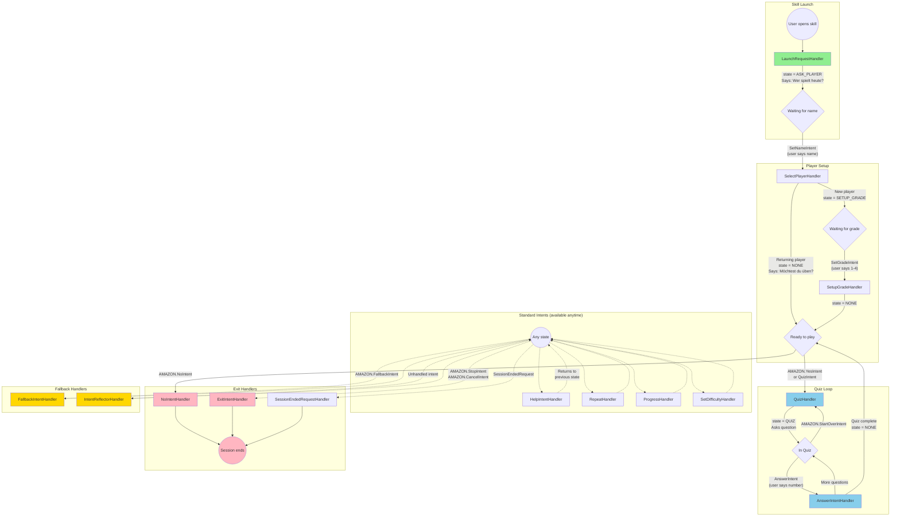

Alexa Math Quiz Skill (Mathe Quiz)
=============

An interactive Alexa skill for German elementary school students (grades 1-4) to practice math skills including addition, subtraction, multiplication, and division.

## Features

* **Adaptive Difficulty**: Automatically adjusts questions based on grade level (1-4)
* **Spaced Repetition System**: Uses an intelligent algorithm to optimize learning by repeating challenging problems
* **Progress Tracking**: Tracks performance across sessions with DynamoDB persistence
* **German Language Support**: Fully localized for German-speaking users (de-DE)
* **Grade-Appropriate Questions**: Question complexity increases with each grade level
* **Performance Analytics**: View statistics on correct answers, streaks, and areas for improvement

## Technology Stack

* **Runtime**: Python 3.14 with [uv](https://docs.astral.sh/uv/) for dependency management
* **Framework**: [Alexa Skills Kit (ASK) Python SDK](https://github.com/alexa/alexa-skills-kit-sdk-for-python)
* **Backend**: AWS Lambda (deployed via GitHub Actions)
* **Persistence**: Amazon DynamoDB
* **CI/CD**: GitHub Actions for automated deployment

## Conversation Flow

The skill uses a state machine to manage the conversation. Here's a diagram showing the intent handlers and their transitions:



### States

| State | Description |
|-------|-------------|
| `ASK_PLAYER` | Waiting for user to say their name |
| `SETUP_GRADE` | Waiting for new player to say their grade (1-4) |
| `QUIZ` | Quiz is active, waiting for answers |
| `NONE` | Idle state, ready to start quiz or exit |

### Key Intent Handlers

| Handler | Trigger | Purpose |
|---------|---------|---------|
| `LaunchRequestHandler` | User opens skill | Welcome and ask for name |
| `SelectPlayerHandler` | `SetNameIntent` in ASK_PLAYER state | Identify player, load/create profile |
| `SetupGradeHandler` | `SetGradeIntent` in SETUP_GRADE state | Set grade for new players |
| `QuizHandler` | `QuizIntent` or `AMAZON.YesIntent` | Start a new quiz session |
| `AnswerIntentHandler` | `AnswerIntent` in QUIZ state | Process answer, track progress |
| `YesIntentHandler` | `AMAZON.YesIntent` | Start quiz (delegates to QuizHandler) |
| `NoIntentHandler` | `AMAZON.NoIntent` | Exit gracefully |
| `IntentReflectorHandler` | Any unhandled intent | Catch-all, prevents errors |

## Developer Setup

This project uses modern Python tooling with [uv](https://docs.astral.sh/uv/) for fast dependency management.

### Prerequisites

- Python 3.14+
- [uv](https://docs.astral.sh/uv/) package manager

### Installation

```bash
# Install uv (if not already installed)
curl -LsSf https://astral.sh/uv/install.sh | sh

# Navigate to lambda directory
cd lambda

# Install dependencies (creates venv automatically)
uv sync
```

### Development Commands

```bash
# Run tests
uv run pytest

# Run tests with coverage
uv run pytest --cov

# Lint code
uv run ruff check .

# Format code
uv run ruff format .

# Type check
uv run mypy .

# Run the skill locally (if applicable)
uv run python lambda_function.py
```

### Project Structure

- `lambda/` - Lambda function code
  - `lambda_function.py` - Main skill handler
  - `alexa/` - Helper modules (data, utilities)
  - `pyproject.toml` - Project dependencies and tool configuration
  - `.python-version` - Python version pin (3.14)

### Dependencies

- **Runtime**: `ask-sdk-core` (Alexa Skills Kit SDK)
- **Dev**: `pytest`, `pytest-cov`, `ruff`, `mypy`

### Adding Dependencies

```bash
# Add runtime dependency
uv add package-name

# Add dev dependency
uv add --dev package-name
```
